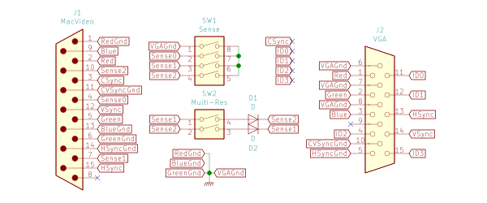

Mac Tech: Displays
==================

.. warning::

   *  Don’t operate a display with parameters (resolution, scan rate, etc.) it wasn’t designed for.
   *  Don’t open an analog display unless you have training on discharging the CRT inside.

   Be careful. Improper electrical work can damage electronics, or you.

.. contents::

Summary
-------

Pinout
~~~~~~

.. table::
   :widths: auto

   ================== ===== =====
   Description        DA-15 VGA
   ================== ===== =====
   Red signal         2     1
   Red ground         1     6
   Green signal       5     2
   Green ground       6     7
   Blue signal        9     3
   Blue ground        13    8
   HSync signal       15    13
   HSync ground       14    5
   VSync signal       12    14
   CSync signal       3     NC
   VSync/CSync ground 11    10
   Sense 0            4     NC
   Sense 1            7     NC
   Sense 2            10    NC
   Unused             8     NC
   Chassis ground     Shell Shell
   ================== ===== =====

I’ve seen schematics with all the grounds (pins 1, 6, 11, 13, and 14)
wired to the shell, and observed this in an adapter in practice.

Configurations
~~~~~~~~~~~~~~

.. table::
   :widths: auto

   ==========  ==============  ===============  ===========  ==============================
   Code        Mode            Resolution       Wiring       Example
   ==========  ==============  ===============  ===========  ==============================
   N/A         8”              512×342          N/A          Macintosh 128k internal
   ----------  --------------  ---------------  -----------  ------------------------------
   000         21” Color       1152×870         G=4=7=10
   001         Apple Portrait  640×870          G=7=10       Macintosh Portrait Display
   010         12”             512×384          G=4=10       Macintosh 12″ RGB Display
   011         21” Mono        1152×870         G=10
   100         NTSC Monitor    512×384          G=4=7        American TV [#ntsc]_
   101         Color Portrait  640×870          G=7          Radius Full Page Display
   110         13”             640×480          G=4          AppleColor High-Resolution RGB Monitor
   ----------  --------------  ---------------  -----------  ------------------------------
   000000      PAL Encoder     512×384          4=7=10       European TV [#pal]_
   010100      NTSC Encoder    512×384          7=10, 10→4   American TV [#ntsc]_
   010111      VGA             800×600 [#vga]_  7=10         Non-Apple monitor
   101101      16”             832×624          4=10
   110000      PAL Monitor     512×384          4=7, 10→4    European TV [#pal]_
   111010      19”             1024×768         4=7
   ----------  --------------  ---------------  -----------  ------------------------------
   110-101011  Up to 13”       Up to 640×480    G=4          (same as 13” above)
   110-000011  Up to 14”       Up to 800×600    G=4, 7=10    Apple Multiple Scan 14 Display
   110-001011  Up to 17”       Up to 1024×768   G=4, 7→10    Apple Multiple Scan 15 Display
   110-100011  Up to 21”       Up to 1152×870?  G=4, 10→7    Apple Multiple Scan 20 Display
   ----------  --------------  ---------------  -----------  ------------------------------
   111-111111  No display                       None
   ==========  ==============  ===============  ===========  ==============================

.. [#ntsc] Overscan 640×480; underscan 512×384. I don’t know what the
   difference between a “NTSC Encoder” and a “NTSC Monitor” is.
.. [#vga] Defaults to 640×480; change to 800×600 and restart.
.. [#pal] Overscan 640×480; underscan 512×384. I don’t know what the
   difference between a “PAL Encoder” and a “PAL Monitor” is.

Details
-------

Compact Mac
~~~~~~~~~~~

The original Macintosh had a single resolution: 512×342. This resolution
remained unchanged on later black and white Macs: the Plus, SE, SE/30,
and Classic. (The Color Classic is 512×384)

.. list-table::
   :widths: auto
   :header-rows: 1
   :stub-columns: 1

   * * Size
     * 8”
   * * Visible area
     * 512×342
   * * Total area
     * 704×370
   * * Scan rate
     * 60.15 Hz
   * * Line rate
     * 22.25 kHz
   * * Dot clock
     * 15.6672 MHz [#15.6672]_
   * * Width
     * 512px
   * * Total width
     * 704px
   * * HBlank
     * 192px
   * * Front porch
     * 14px
   * * HSync
     * 288px
   * * Back porch
     * -110px [#neg-porch]_
   * * Height
     * 342px
   * * Total height
     * 370px
   * * VBlank
     * 28px
   * * Front porch
     * 0px
   * * VSync
     * 4px
   * * Back porch
     * 24px

.. [#15.6672] 15.6672 MHz is twice the clock rate of the original
   Macintosh, or 68 * 32 * 7200 Hz.
.. [#neg-porch] The HSync pulse is longer than the the HBlank interval,
   so it overlaps the visible part of the scan line, and there is no
   back porch.

Sense codes
~~~~~~~~~~~

The Macintosh II required an external display, and connected to it
through a DA-15 video port. Aside from the signal and ground pins, three
sense pins were used so that the computer would know what kind of
display was connected. Any or all of them could be grounded, identifying
8 possible configurations_.

These configurations are identified by a three bit sense code ``ABC``:

* A=0 if sense 2 (pin 10) is grounded; A=1 if floating
* B=0 if sense 1 (pin 7) is grounded; B=1 if floating
* C=0 if sense 0 (pin 4) is grounded; C=1 if floating

.. list-table::
   :widths: auto
   :header-rows: 1
   :stub-columns: 1

   * * Size
     * 12”
     * 13” [#640x400]_
     * Portrait
     * 21”
   * * Sense codes
     * 010
     * 110
     * 101, 001
     * 000, 011
   * * Visible area
     * 512×384
     * 640×480
     * 640×870
     * 1152×870
   * * Total area
     * 640×407
     * 864×525
     * 832×918
     * 1456×915
   * * Scan rate
     * 60.15 Hz
     * 66.67 Hz
     * 75 Hz
     * 75 Hz
   * * Line rate
     * 24.48 kHz [#24.48]_
     * 35.00 kHz
     * 68.9 kHz
     * 68.68 kHz
   * * Dot clock
     * 15.6672 MHz
     * 30.24 MHz
     * 57.2832 MHz
     * 100 MHz
   * * Width
     * 512px
     * 640px
     * 640px
     * 1152px
   * * Total width
     * 640px
     * 864px
     * 832px
     * 1456
   * * HBlank
     * 128px
     * 224px
     * 192px
     * 304px
   * * Front porch
     * 16px
     * 64px
     * 32px
     * 32px
   * * HSync
     * 32px
     * 64px
     * 80px
     * 128px
   * * Back porch
     * 80px
     * 96px
     * 80px
     * 144px
   * * Height
     * 384px
     * 480px
     * 870px
     * 870px
   * * Total height
     * 407px
     * 525px
     * 918px
     * 915px
   * * VBlank
     * 23px
     * 45px
     * 48px
     * 45px
   * * Front porch
     * 1px
     * 3px
     * 3px
     * 3px
   * * VSync
     * 3px
     * 3px
     * 3px
     * 3px
   * * Back porch
     * 19px
     * 39px
     * 42px
     * 39px

.. [#640x400] Some machines with low amounts of VRAM support a “640×400”
   mode, allowing 16-bit color at the cost of screen space. The
   parameters are the same as 640×480, letterboxing it by adding 40px
   each to the front and back porch.
.. [#24.48] While this resolution shares the overall scan rate (60.15
   Hz) and dot clock (15.6672) with the Compact 8” resolution, the
   line rate differs. Despite having the same total pixel size, the
   total area is more squarish. Reusing the 8” screen’s parameters would
   have been impossible, because its total height is less than 384px.

Extended Type-7 sense codes
~~~~~~~~~~~~~~~~~~~~~~~~~~~

With more resolutions, new sense codes were needed. In order to prevent
older computers from detecting these newer displays and trying to
display to them, the three sense pins were left ungrounded (which
indicates “no display attached” to older computers), and some
combination of the sense pins were tied together, either directly or
with diodes. To detect the display, the computer would:

1. Check if any sense pins are grounded (indicating a non-extended code)
2. Ground each sense pin in turn, checking which other pins were pulled
   low in response.

These configurations are identified by a six bit sense code ``ABCDEF``:

* A=0 if grounding sense 2 (pin 10) would pull sense 1 (pin 7) low
* B=0 if grounding sense 2 would pull sense 0 (pin 4) low
* C=0 if grounding sense 1 would pull sense 2 low
* D=0 if grounding sense 1 would pull sense 0 low
* E=0 if grounding sense 0 would pull sense 2 low
* F=0 if grounding sense 0 would pull sense 1 low

(note that there are 29 possible Type-7 sense codes, not 64, and most
are unassigned)

.. list-table::
   :widths: auto
   :header-rows: 1
   :stub-columns: 1

   * * Size
     * 16”
     * 19”
   * * Sense codes
     * 101101
     * 111010
   * * Visible area
     * 832×624
     * 1024×768
   * * Total area
     * 1152×667
     * 1328×804
   * * Scan rate
     * 75 Hz
     * 75 Hz
   * * Line rate
     * 49.73 kHz
     * 60.24 kHz
   * * Dot clock
     * 57.2832 MHz
     * 80 MHz
   * * Width
     * 832px
     * 1024px
   * * Total width
     * 1152px
     * 1328px
   * * HBlank
     * 320px
     * 304px
   * * Front porch
     * 32px
     * 32px
   * * HSync
     * 64px
     * 96px
   * * Back porch
     * 224px
     * 176px
   * * Height
     * 624px
     * 768px
   * * Total height
     * 667px
     * 804px
   * * VBlank
     * 43px
     * 36px
   * * Front porch
     * 1px
     * 3px
   * * VSync
     * 3px
     * 3px
   * * Back porch
     * 39px
     * 30px

Extended Type-6 sense codes
~~~~~~~~~~~~~~~~~~~~~~~~~~~

Eventually displays became able to support multiple resolutions. The
minimum resolution supported by such displays was 640×480, so the 13”
sense code (grounding pin 4) became the baseline for multiple-resolution
displays. Older computers would detect multiple scan monitors as 640×480
displays. For larger resolutions, pins 7 and 10 were connected:

1. Directly for 14” (max 832×624) [#both]_
2. With a diode from 7 to 10 for 17” (max 1024×768)
3. With a diode from 10 to 7 for 21” (max 1152×870)

These configurations are identified by a nine-bit sense code: three bits
indicating which pins are grounded (always 110 in practice) plus a six
bit Type-7 sense code.

.. [#both] VGA adapters may handle this by connecting a diode in both
   directions. This is fine. It’s convenient when such adapters already
   have dip switches to diodes for the larger resolutions.

Appendix A: Apple IIe
~~~~~~~~~~~~~~~~~~~~~

Machines that can host an Apple IIe card are capable of outputting
560×384, which is double the IIe’s 280×192 “Hi Resolution” graphics
mode. It shares its vertical parameters with the standard Macintosh
512×384 mode, but runs with a faster dot clock.

.. list-table::
   :widths: auto
   :header-rows: 1
   :stub-columns: 1

   * * Size
     * 12”
     * Quad Hi-Res
   * * Visible area
     * 512×384
     * 560×384
   * * Total area
     * 640×407
     * 704×407
   * * Scan rate
     * 60.15 Hz
     * 60.15 Hz
   * * Line rate
     * 24.48 kHz
     * 24.48 kHz
   * * Dot clock
     * 15.6672 MHz
     * 17.2340 MHz
   * * Width
     * 512px
     * 560px
   * * Total width
     * 640px
     * 704px
   * * HBlank
     * 128px
     * 144px
   * * Front porch
     * 16px
     * 16px
   * * HSync
     * 32px
     * 48px
   * * Back porch
     * 80px
     * 80px
   * * Height
     * 384px
     * 384px
   * * Total height
     * 407px
     * 407px
   * * VBlank
     * 23px
     * 23px
   * * Front porch
     * 1px
     * 1px
   * * VSync
     * 3px
     * 3px
   * * Back porch
     * 19px
     * 19px

Appendix B: VGA Timing
~~~~~~~~~~~~~~~~~~~~~~

For comparison, here are the standard timings for VGA resolutions at 60
Hz:

.. list-table::
   :widths: auto
   :header-rows: 1
   :stub-columns: 1

   * * Size
     * VGA
     * SVGA
     * XGA
   * * Visible area
     * 640×480
     * 800×600
     * 1024×768
   * * Total area
     * 800×525
     * 1056×628
     * 1344×806
   * * Scan rate
     * 60 Hz
     * 60 Hz
     * 60 Hz
   * * Line rate
     * 31.46875 kHz
     * 37.8787… kHz
     * 48.3630… kHz
   * * Dot clock
     * 25.175 MHz
     * 40 MHz
     * 65 MHz
   * * Width
     * 640px
     * 800px
     * 1024px
   * * Total width
     * 800px
     * 1056px
     * 1344px
   * * HBlank
     * 160px
     * 256px
     * 320px
   * * Front porch
     * 16px
     * 40px
     * 24px
   * * HSync
     * 96px
     * 128px
     * 136px
   * * Back porch
     * 48px
     * 88px
     * 160px
   * * Height
     * 480px
     * 600px
     * 768px
   * * Total height
     * 525px
     * 628px
     * 806px
   * * VBlank
     * 45px
     * 28px
     * 38px
   * * Front porch
     * 10px
     * 1px
     * 3px
   * * VSync
     * 2px
     * 4px
     * 6px
   * * Back porch
     * 33px
     * 23px
     * 29px

Adapters
--------

Generic adapter
~~~~~~~~~~~~~~~

For a VGA adapter:

1. Omit the dip switches and diodes.
2. Wire Sense1 and Sense2 (DA-15 pins 7 and 10) together directly.

For a multi-scan adapter:

1. Omit the dip switches.
2. Wire VGAGnd and Sense0 (D-15 pin 4 and ground) together directly.
3. Connect Sense1 and Sense2 (DA-15 pins 7 and 10) according to the
   maximum resolution of the display:

   * 1152×870: diode with cathode on Sense1 (DA-15 pin 7)
   * 1024×768: diode with cathode on Sense2 (DA-15 pin 10)
   * 832×624: wire pins together directly
   * 640×480: no diodes

See Also
--------

* http://mirror.informatimago.com/next/developer.apple.com/technotes/hw/pdf/hw_30.pdf
* http://www.saragossa.net/intfcing.html
* http://www.codesrc.com/mediawiki/index.php/Macintosh_VGA
* http://www.3dexpress.de/displayconfigx/timings.html
* http://mirror.informatimago.com/next/developer.apple.com/documentation/Hardware/Developer_Notes/Macintosh_CPUs-68K_Desktop/Mac_LC_III.pdf

..  -*- tab-width: 3; fill-column: 72 -*-
